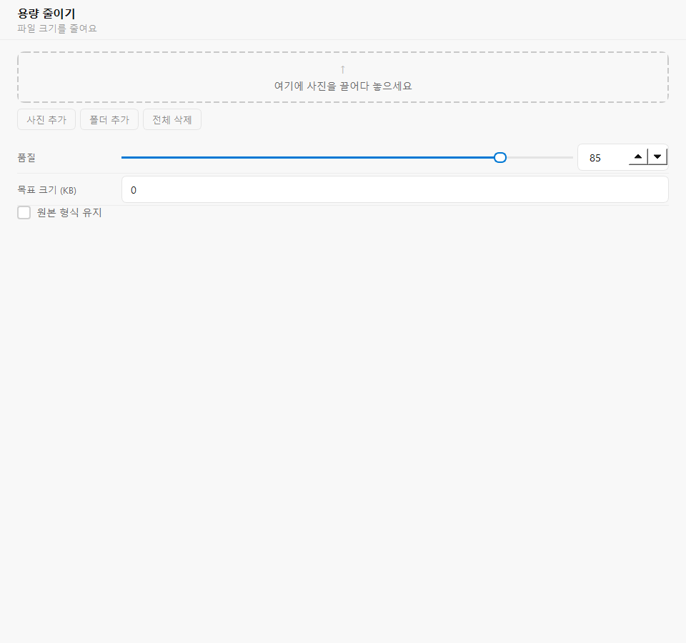

# HyoT Image Tools

<p align="center">
  
</p>

**Batch image processing for Windows** — resize, compress, convert, crop, rotate, merge, and rename photos in one desktop app.



## Features

| Tool | Description |
|------|-------------|
| **Resize** | Scale by percentage, exact dimensions, or longest side |
| **Reduce Size** | Compress JPEG/WebP/PNG with quality or target file size |
| **Convert Format** | Convert between JPG, PNG, WebP, BMP, and TIFF |
| **Rotate / Flip** | Rotate at any angle, flip, and auto-apply EXIF orientation |
| **Crop** | Interactive crop with aspect-ratio presets |
| **Merge Images** | Combine images horizontally, vertically, or in a grid |
| **Bulk Rename** | Batch-rename files with prefix, numbering, and padding |

Additional highlights:

- Drag-and-drop or folder import
- Live before/after preview (resize, rotate, merge)
- Dark and light themes · Korean / English UI
- Background batch processing with progress and cancel
- Saves to a chosen folder with optional suffix and overwrite

## Requirements

- **Python** 3.10 or later
- **PyQt6** — desktop UI
- **Pillow** — image read/write and processing
- **Windows** 10 22H2+ (x64) recommended

## Install & run

```bash
git clone https://github.com/furss123/hyot-image-tools.git
cd HyoT-Image-Tools
python -m venv .venv
.venv\Scripts\activate
pip install -r requirements.txt
python main.py
```

On macOS/Linux, activate with `source .venv/bin/activate` instead.

## Screenshots

Place additional screenshots in the [`screenshots/`](screenshots/) folder.

| Preview | Path |
|---------|------|
| Main window | `screenshots/main.png` |

## Build (optional)

A Windows installer and portable ZIP are produced by [GitHub Actions](.github/workflows/release.yml) when a `v*` tag is pushed.

Local one-file executable (optional):

```bash
pip install pyinstaller
pyinstaller --onefile --windowed --icon=app/assets/icon.ico main.py
```

For the full onedir build used in releases:

```bash
pip install pyinstaller
python scripts/build.py
```

## License

[MIT](LICENSE) © 2026 HyoT
